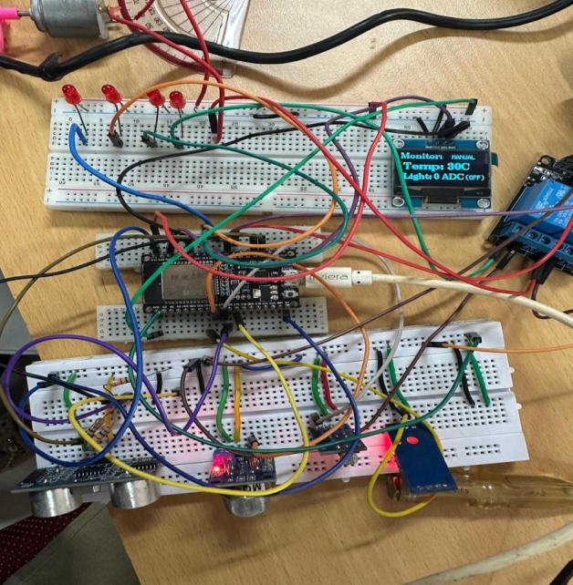
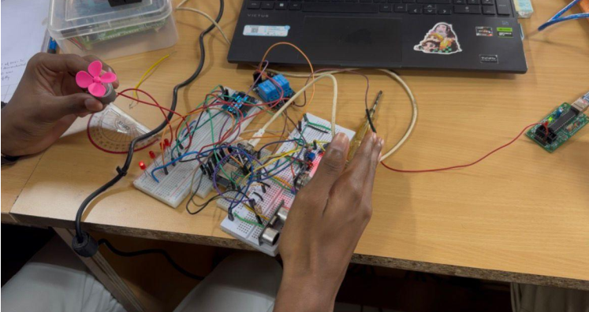
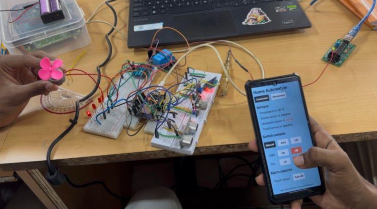

# Smart Home Automation System using ESP32 and FreeRTOS

A Smart Home Automation System developed using the **ESP32 DevKitC** and **FreeRTOS** to provide real-time environmental monitoring, appliance automation, and Bluetooth-based remote control. The system integrates multiple sensors and actuators to create an intelligent, responsive, and user-friendly home automation solution.

---

# Project Overview

This project utilizes the ESP32's dual-core processor and FreeRTOS multitasking capabilities to simultaneously monitor environmental conditions and control home appliances.

The system automatically controls a fan and light based on sensor readings while also allowing manual control through Bluetooth. An OLED display provides real-time system status, and safety features such as smoke detection and intrusion alerts improve reliability.

---

# Features

- FreeRTOS Multitasking
- ESP32 Dual-Core Processing
- Bluetooth Serial Remote Control
- Automatic Fan Control
- Automatic Light Control
- Smoke Detection and Alarm
- Ultrasonic-Based Object Detection
- Capacitive Touch Detection
- OLED Display Interface
- Real-Time Monitoring
- Manual and Automatic Modes

---

# Hardware Components

- ESP32 DevKitC
- DHT11 Temperature Sensor
- MQ2 Gas/Smoke Sensor
- LDR Sensor
- HC-SR04 Ultrasonic Sensor
- Capacitive Touch Sensor
- SSD1306 OLED Display
- 2-Channel Relay Module
- Fan
- Light Bulb
- LEDs
- Buzzers

---

# Software Used

- Arduino IDE
- ESP32 Arduino Core
- Embedded C
- FreeRTOS
- Bluetooth Serial
- U8g2 Graphics Library

---

# System Workflow

```text
                Smartphone
                     │
              Bluetooth Serial
                     │
                     ▼
              ESP32 + FreeRTOS
                     │
    ┌────────────────┼────────────────┐
    │                │                │
 Temperature      Light          Smoke Sensor
     │              │                 │
     ▼              ▼                 ▼
 Automatic Fan   Automatic Light   Alarm System
                     │
                     ▼
                OLED Display
```

---

# Hardware Setup

The complete hardware implementation.



---

# Sensor Testing

Testing of sensors and real-time monitoring.



---

# Bluetooth Application Control

Manual appliance control using the Bluetooth mobile application.



---

# Repository Structure

```text
Smart-Home-Automation-System-ESP32/
│
├── README.md
├── LICENSE
├── .gitignore
│
├── arduino/
│   ├── Smart_Home_Automation.ino
│   └── README.md
│
├── docs/
│   ├── Smart_Home_Automation_Report.pdf
│   └── README.md
│
├── circuit/
│   ├── wiring_diagram.png
│   └── README.md
│
├── libraries/
│   └── README.md
│
└── images/
    ├── setup.png
    ├── testing_sensor.png
    └── testing_with_app.png
```

---

# Pin Mapping

| Component | ESP32 GPIO |
|------------|-----------:|
| DHT11 | GPIO33 |
| LDR | GPIO26 |
| MQ2 | GPIO25 |
| Ultrasonic Trigger | GPIO15 |
| Ultrasonic Echo | GPIO2 |
| Fan Relay | GPIO17 |
| Light Relay | GPIO16 |
| Smoke Buzzer | GPIO14 |
| Smoke LED | GPIO5 |
| Ultrasonic LED | GPIO18 |
| Push Button | GPIO32 |
| OLED SDA | GPIO21 |
| OLED SCL | GPIO22 |

---

# FreeRTOS Tasks

- Temperature Monitoring
- Automatic Fan Control
- Light Monitoring
- Automatic Light Control
- Smoke Detection
- Push Button Detection
- Bluetooth Command Processing
- OLED Display Updates

---

# Bluetooth Commands

| Command | Function |
|----------|----------|
| A | Automatic Mode |
| M | Manual Mode |
| F | Fan ON |
| Y | Fan OFF |
| L | Light ON |
| Z | Light OFF |
| O | Turn OFF All Devices |

---

# Applications

- Smart Home Automation
- IoT Systems
- Home Security
- Fire Detection
- Environmental Monitoring
- Embedded Systems
- Real-Time Control

---

# Future Improvements

- Wi-Fi and MQTT Integration
- Mobile Application
- Cloud Data Logging
- Voice Assistant Support
- OTA Firmware Updates
- Smart Energy Monitoring

---

# Documentation

The detailed project report is available in:

```text
docs/Smart_Home_Automation_Report.pdf
```

---

# Author

**Sathish M**

B.E. Electronics and Communication Engineering

PSG College of Technology

GitHub: https://github.com/rio-sathish

LinkedIn: https://www.linkedin.com/in/sathish-m-b19844289/

---

# License

This project is licensed under the MIT License.
